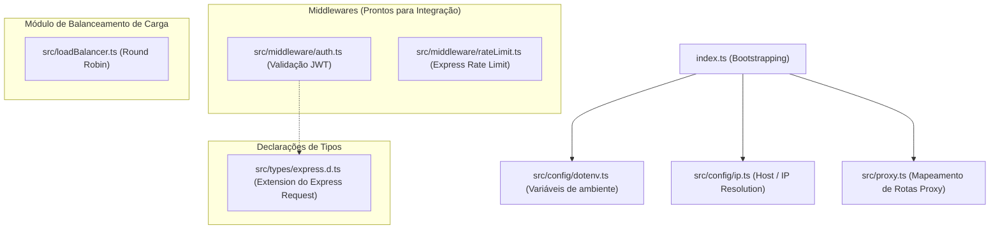

# Documentação Completa do Dass API Gateway

Este documento detalha o funcionamento técnico, a arquitetura, o fluxo de dados, a estrutura de código e os guias práticos de execução via **PM2** e **Docker** do **Dass API Gateway**.

---

## 1. Visão Geral e Arquitetura do Sistema

O **Dass API Gateway** é uma aplicação construída em **Node.js** com **TypeScript** e **Express**. Ele atua como ponto único de entrada (Single Point of Entry) para a infraestrutura de APIs da organização, sendo responsável por:

1. **Roteamento de Requisições (Reverse Proxy)**: Recebe requisições HTTP e as repassa para mais de 19 microserviços internos usando `http-proxy-middleware`.
2. **Reescrita de Caminho (Path Rewriting)**: Remove o prefixo `/api/<servico>` das URLs antes de encaminhar as requisições para o microserviço de destino.
3. **Segurança e Comunicação**: Aplica regras de CORS (Cross-Origin Resource Sharing) e cabeçalhos de segurança HTTP via `helmet`.
4. **Gerenciamento de Ambiente**: Suporta alternância dinâmica entre ambiente de desenvolvimento (`.env`) e produção (`.env.production`).

---

## 2. Diagramas de Arquitetura e Fluxo (Mermaid)

### Diagrama 1: Fluxo Geral de Requisições do Cliente aos Microserviços

```mermaid
flowchart TD
    Client["Navegador / App Cliente"]
    
    subgraph Gateway["Dass API Gateway (Porta 2399)"]
        CorsHelmet["CORS + Helmet"]
        Router["Express Router & Proxy Engine"]
    end
    
    subgraph Microservices["Infraestrutura de Microserviços"]
        Telas["Telas Service (/api/telas)"]
        SobraCorte["SobraCorte Service (/api/sobracorte)"]
        Upload["Upload Service (/api/upload)"]
        Diesel["Diesel Service (/api/diesel)"]
        PortaEmerg["Porta Emerg Service (/api/porta-emerg)"]
        Portaria["Portaria Service (/api/portaria)"]
        IndexInf["Index Informativo (/api/index-informativo)"]
        Automation["Automation Service (/api/automation)"]
        DP["DP Service (/api/dp)"]
        Quimico["Quimico Service (/api/quimico)"]
        PCP["PCP Service (/api/pcp)"]
        Refeitorio["Refeitorio Service (/api/refeitorio)"]
        Lean["Lean Service (/api/lean)"]
        AttOta["Att OTA Service (/api/att-ota)"]
        Brinde["Solicitação Brinde (/api/solicitacao-brinde)"]
        Checklist["Checklist Maquina (/api/checklist-maquina)"]
        AlmoxTI["Almoxarifado TI (/api/almoxarifado-ti)"]
        DassUsers["Dass Users (/api/dass-users)"]
        SynapseTI["Synapse TI (/api/synapse-ti)"]
        MainSvc["Main Service (Fallback /api/*)"]
    end

    Client -->|Requisição HTTP| CorsHelmet
    CorsHelmet --> Router
    
    Router -->|/api/telas/*| Telas
    Router -->|/api/sobracorte/*| SobraCorte
    Router -->|/api/upload/*| Upload
    Router -->|/api/diesel/*| Diesel
    Router -->|/api/porta-emerg/*| PortaEmerg
    Router -->|/api/portaria/*| Portaria
    Router -->|/api/index-informativo/*| IndexInf
    Router -->|/api/automation/*| Automation
    Router -->|/api/dp/*| DP
    Router -->|/api/quimico/*| Quimico
    Router -->|/api/pcp/*| PCP
    Router -->|/api/refeitorio/*| Refeitorio
    Router -->|/api/lean/*| Lean
    Router -->|/api/att-ota/*| AttOta
    Router -->|/api/solicitacao-brinde/*| Brinde
    Router -->|/api/checklist-maquina/*| Checklist
    Router -->|/api/almoxarifado-ti/*| AlmoxTI
    Router -->|/api/dass-users/*| DassUsers
    Router -->|/api/synapse-ti/*| SynapseTI
    Router -->|/api/* (Qualquer outra rota)| MainSvc
```

### Diagrama 2: Estrutura Interna de Módulos do Gateway



---

## 3. Detalhamento dos Componentes do Código

### 3.1. Arquivo Principal (`index.ts`)
- **Papel**: Ponto de entrada do sistema.
- **Funcionamento**:
  - Cria a aplicação Express e o servidor HTTP nativo do Node.js.
  - Aplica o middleware `cors` liberando origens específicas de IP/domínio corporativo (como `http://localhost:5173`, `http://10.100.1.43`, etc.) com `credentials: true`.
  - Ativa proteção de cabeçalhos HTTP com `helmet()`.
  - Invoca `setupProxy(app, server)` para montar as regras de proxy.
  - Disponibiliza uma rota de healthcheck em `GET /` que retorna `{"message": "Dass API Gateway is running!"}`.
  - Inicia a escuta do servidor na porta definida por `vars.GATEWAY_PORT`.

### 3.2. Configurações (`src/config/dotenv.ts` e `src/config/ip.ts`)
- **`dotenv.ts`**:
  - Detecta se a variável `DEV_ENV` está preenchida. Se presente, carrega `.env`; caso contrário, carrega `.env.production`.
  - Exporta o objeto `vars` mapeando a porta do gateway, segredos JWT e as URLs base dos 20 microserviços.
- **`ip.ts`**:
  - Define o IP base de vinculação: retorna `"localhost"` em modo de desenvolvimento ou `"10.100.1.43"` em produção.

### 3.3. Motor de Proxy (`src/proxy.ts`)
- **Papel**: Central de roteamento inverso.
- **Funcionamento**: Usa `http-proxy-middleware` para mapear os prefixos de URL para suas respectivas URLs de backend e reescreve a URL removendo o prefixo.
- **Regra de Fallback**: A rota `/api` apontando para `MAIN_SERVICE` fica posicionada obrigatoriamente por último no arquivo para capturar qualquer subrota genérica não coberta pelos serviços específicos.

### 3.4. Balanceador de Carga (`src/loadBalancer.ts`)
- **Papel**: Implementação de um algoritmo de Round-Robin simples.
- **Funcionamento**: Seleciona iterativamente a próxima instância da lista `mainInstances` a cada requisição. Atualmente estruturado para rápida integração e escalabilidade horizontal do `MAIN_SERVICE`.

### 3.5. Middlewares (`src/middleware/auth.ts` e `src/middleware/rateLimit.ts`)
- **`auth.ts`**: Valida se o cookie `token` existe na requisição e verifica sua assinatura JWT usando `JWT_SECRET`. Se válido, decodifica as propriedades do usuário (`id`, `usuario`, `matricula`, `setor`, `nivel`, etc.) e injeta em `req.user`.
- **`rateLimit.ts`**: Define um limite de **100 requisições a cada 15 minutos** por endereço IP para prevenir abusos.

### 3.6. Tipagem TypeScript (`src/types/express.d.ts`)
- Extende o tipo `Request` do Express globalmente para suportar a propriedade `req.user` tipada com a interface `DecodedToken`.

---

## 4. Guia de Execução com PM2 (Process Manager 2)

O **PM2** é o gerenciador de processos ideal para rodar a aplicação diretamente no servidor Node.js em ambiente de produção com suporte a reinicialização automática, logs e monitoramento.

### Passo 1: Instalar o PM2 (caso não possua)
```bash
npm install -g pm2
```

### Passo 2: Compilar o código TypeScript
Antes de rodar com o PM2 em produção, compile o código para JavaScript:
```bash
npm run build
```
*(Isso gerará os arquivos compilados na pasta `dist/`)*

### Passo 3: Iniciar a aplicação no PM2

#### Opção A: Linha de comando direta
```bash
# Executando o arquivo compilado em dist/index.js
pm2 start dist/index.js --name "dass-api-gateway"
```

#### Opção B: Utilizando um arquivo de ecossistema (`ecosystem.config.js`)
Crie um arquivo chamado `ecosystem.config.js` na raiz do projeto com o seguinte conteúdo:

```javascript
module.exports = {
  apps: [
    {
      name: "dass-api-gateway",
      script: "./dist/index.js",
      instances: "max", // ou 1 para instância única
      exec_mode: "cluster", // "cluster" ou "fork"
      env_production: {
        NODE_ENV: "production"
      },
      env_development: {
        NODE_ENV: "development",
        DEV_ENV: "development"
      }
    }
  ]
};
```

Para iniciar usando o ecossistema em produção:
```bash
pm2 start ecosystem.config.js --env production
```

### Comandos Úteis do PM2
```bash
# Visualizar status das aplicações
pm2 status

# Monitorar uso de CPU e Memória em tempo real
pm2 monit

# Visualizar logs em tempo real
pm2 logs dass-api-gateway

# Reiniciar o serviço
pm2 restart dass-api-gateway

# Recarregar o serviço sem downtime (modo cluster)
pm2 reload dass-api-gateway

# Parar o serviço
pm2 stop dass-api-gateway

# Remover o serviço da lista do PM2
pm2 delete dass-api-gateway

# Configurar autostart do PM2 ao reiniciar o servidor OS
pm2 startup
pm2 save
```

---

## 5. Guia de Execução com Docker e Docker Compose

### 5.1. Execução isolada com Docker

#### 1. Gerar a imagem Docker
```bash
docker build -t dass-api-gateway .
```

#### 2. Rodar o Container
```bash
docker run -d \
  --name gateway-app \
  -p 2399:2399 \
  --env-file .env \
  dass-api-gateway
```

---

### 5.2. Execução com Docker Compose (Recomendado)

O projeto já inclui um `docker-compose.yml` pré-configurado. 

#### Requisito Prévia: Rede Docker Externa
O `docker-compose.yml` utiliza a rede externa chamada `dass_private`. Verifique se ela existe:
```bash
docker network ls
```

Se a rede não existir, crie-a antes de iniciar o container:
```bash
docker network create dass_private
```

#### Subir o container com Docker Compose:
```bash
docker compose up -d --build
```

#### Comandos Úteis do Docker Compose:
```bash
# Verificar status dos containers
docker compose ps

# Visualizar logs em tempo real
docker compose logs -f

# Parar os serviços
docker compose down

# Reiniciar o serviço
docker compose restart
```

---

## 6. Tabela de Variáveis de Ambiente

Crie um arquivo `.env` (desenvolvimento) ou `.env.production` (produção) na raiz do projeto com as seguintes chaves:

| Variável | Descrição | Exemplo de Valor |
| :--- | :--- | :--- |
| `DEV_ENV` | Define se o ambiente é de desenvolvimento | `development` |
| `GATEWAY_PORT` | Porta onde o API Gateway irá rodar | `2399` ou `2307` |
| `JWT_SECRET` | Chave secreta para validação dos tokens JWT | `sua_chave_secreta_aqui` |
| `MAIN_SERVICE` | URL do microserviço principal (Fallback `/api/*`) | `http://localhost:2121` |
| `TELAS_SERVICE` | URL da API de Telas | `http://10.100.1.43:3046` |
| `SOBRACORTE_SERVICE` | URL da API Sobracorte | `http://10.100.1.43:9137` |
| `UPLOAD_SERVICE` | URL da API de Upload | `http://localhost:4000` |
| `DIESEL_SERVICE` | URL da API Diesel | `http://localhost:4001` |
| `PORTA_EMERG_SERVICE` | URL da API Porta de Emergência | `http://localhost:4002` |
| `PORTARIA_SERVICE` | URL da API Portaria | `http://localhost:4003` |
| `INDEX_INFORMATIVO_SERVICE` | URL da API Index Informativo | `http://localhost:4004` |
| `AUTOMATION_SERVICE` | URL da API de Automação | `http://localhost:4005` |
| `DP_SERVICE` | URL da API de DP | `http://localhost:4006` |
| `QUIMICO_SERVICE` | URL da API de Químico | `http://localhost:4007` |
| `PCP_SERVICE` | URL da API PCP | `http://localhost:4008` |
| `REFEITORIO_SERVICE` | URL da API Refeitório | `http://localhost:4009` |
| `LEAN_SERVICE` | URL da API Lean | `http://localhost:4010` |
| `ATT_OTA_SERVICE` | URL da API Att OTA | `http://localhost:4011` |
| `SOLICITACAO_BRINDE_SERVICE` | URL da API Solicitacao Brinde | `http://localhost:4012` |
| `CHECKLIST_MAQUINA_SERVICE` | URL da API Checklist Maquina | `http://localhost:4013` |
| `ALMOXARIFADO_TI` | URL da API Almoxarifado TI | `http://localhost:4014` |
| `DASS_USERS` | URL da API Dass Users | `http://localhost:4015` |
| `SYNAPSE_TI` | URL da API Synapse TI | `http://localhost:4016` |

---

## 7. Verificação de Funcionamento

O código-fonte foi verificado através do compilador do TypeScript (`tsc --noEmit`), garantindo que:
- Não há erros de sintaxe ou de importação de módulos.
- Os tipos do Express e das bibliotecas de terceiros (`jsonwebtoken`, `http-proxy-middleware`, `cors`, `helmet`) estão devidamente alinhados.
- As rotas e middlewares estão estruturados de forma coerente e funcional.
